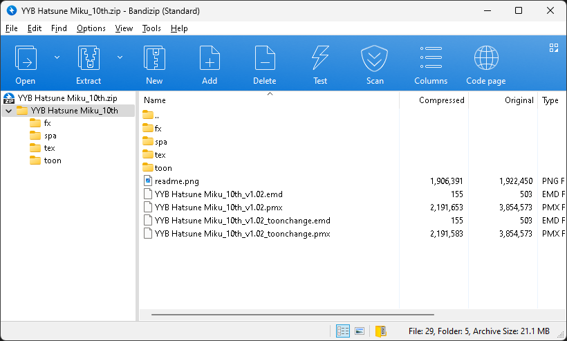
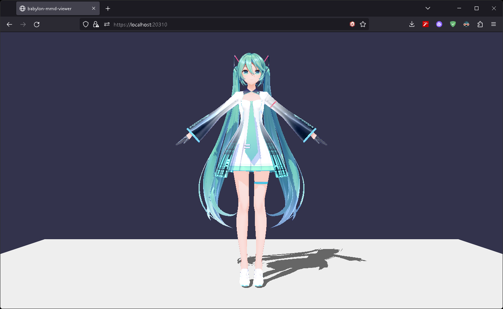

# Load MMD Model

Learn how to load models in PMX format.

## Download MMD Model: "YYB Hatsune Miku_10th"

If you have a pmx model you want, you can use it.

In this tutorial, we will use the "YYB Hatsune Miku_10th" model.

You can download it from **[here](https://www.deviantart.com/sanmuyyb/art/YYB-Hatsune-Miku-10th-DL-702119716)**.



Unzip the downloaded zip file and copy the "YYB Hatsune Miku_10th" folder to the "res" folder.


Your file structure should look like this.

## Load PMX Model

For load pmx model, we need to import side effects.

```typescript title="src/sceneBuilder.ts"
import "babylon-mmd/esm/Loader/pmxLoader";
```

Then, load the model using the `SceneLoader`.

```typescript title="src/sceneBuilder.ts"
const mmdMesh = await SceneLoader.ImportMeshAsync("", "res/YYB Hatsune Miku_10th/", "YYB Hatsune Miku_10th_v1.02.pmx", scene)
    .then((result) => result.meshes[0] as Mesh);
mmdMesh.receiveShadows = true;
shadowGenerator.addShadowCaster(mmdMesh);
```

- `SceneLoader.ImportMeshAsync` - Load the model using the `SceneLoader` (All other loading methods are supported, but this example uses `ImportMeshAsync`).
    - `""` - this parameter is not used in PMX loading.
    - `"res/YYB Hatsune Miku_10th/"` - the path to the model file.
    - `"YYB Hatsune Miku_10th_v1.02.pmx"` - If you pass a File object, you can load the model from the File object.
    - `scene` - the scene to load the model into.

- An importMeshAsync call in pmx file guarantees that result.meshes length is always 1.

- Below is the shadow setting I won't explain in detail.


