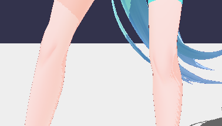

# Troubleshooting Shading Artifacts

This section addresses common shading issues.

## Shadow Artifacts at Joints

The MMD model use Spherical Deformation which is not supported in shadow map. So, the shadow at the joint will be broken.



To resolve this issue, you can force all shaders to support SDEF or disable the SDEF feature when loading pmx.

:::info
Note that with SDEF, you get the same results as MMD, but use more performance
:::

```typescript title="src/sceneBuilder.ts"
SdefInjector.OverrideEngineCreateEffect(engine); // Force all shaders to support SDEF
// this method must be called before creating the scene
```

or

```typescript title="src/sceneBuilder.ts"
const pmxLoader = SceneLoader.GetPluginForExtension(".pmx") as PmxLoader;
pmxLoader.useSdef = false; // Disable SDEF
```

Result:


## Transparent Artifacts

This is a problem that was not shown in this tutorial, but for models that use a lot of alpha textures, the high probability of shading will be weird.

Although an algorithm is implemented to determine whether to render materials as alpha blending, it is impossible to achieve perfect results because Babylon.js and MMD's alpha blending methods are different.

So to solve this problem, you need to hardcode whether the material is alpha blended or not. Like this:

```typescript title="src/sceneBuilder.ts"
const pmxLoader = SceneLoader.GetPluginForExtension(".pmx") as PmxLoader;
pmxLoader.useSdef = false;
const materialBuilder = pmxLoader.materialBuilder as MmdStandardMaterialBuilder;
materialBuilder.useAlphaEvaluation = false;
const alphaBlendMaterials = ["face02", "Facial02", "HL", "Hairshadow", "q302"];
const alphaTestMaterials = ["q301"];
materialBuilder.afterBuildSingleMaterial = (material): void => {
    if (!alphaBlendMaterials.includes(material.name) && !alphaTestMaterials.includes(material.name)) return;
    material.transparencyMode = alphaBlendMaterials.includes(material.name)
        ? Material.MATERIAL_ALPHABLEND
        : Material.MATERIAL_ALPHATEST;
    material.useAlphaFromDiffuseTexture = true;
    material.diffuseTexture!.hasAlpha = true;
};
```

- `useAlphaEvaluation` - If false, all material loaded as opaque.
- `afterBuildSingleMaterial` - This callback is called after the material is created. You can use this to preprocess the material.

## Outline Artifacts

Outline rendering often causes problems with materials that are alpha-blended.

In this case, you should consider turning off outline rendering partially or disabling it in loaders.

```typescript title="src/sceneBuilder.ts"
const pmxLoader = SceneLoader.GetPluginForExtension(".pmx") as PmxLoader;
const materialBuilder = pmxLoader.materialBuilder as MmdStandardMaterialBuilder;

materialBuilder.loadOutlineRenderingProperties = () => { /* do nothing */ };
```

- `loadOutlineRenderingProperties` - This callback is called when loading the outline rendering properties. You can override this to customize the outline rendering properties.

:::tip
Deactivating at load time is more efficient than deactivating after loading. Because once loaded, the shader gets compiled

So if you want to make any changes to the loaded asset, check the loader option first
:::

## Full code applied up to here

```typescript title="src/sceneBuilder.ts"
import type { Engine, Mesh } from "@babylonjs/core";
import { DirectionalLight, HavokPlugin, HemisphericLight, Material, MeshBuilder, Scene, SceneLoader, ShadowGenerator, Vector3 } from "@babylonjs/core";
import HavokPhysics from "@babylonjs/havok";
import type { MmdStandardMaterialBuilder } from "babylon-mmd";
import { MmdCamera, MmdPhysics, MmdPlayerControl, MmdRuntime, PmxLoader, SdefInjector, StreamAudioPlayer, VmdLoader } from "babylon-mmd";

import type { ISceneBuilder } from "./baseRuntime";

export class SceneBuilder implements ISceneBuilder {
    public async build(_canvas: HTMLCanvasElement, engine: Engine): Promise<Scene> {
        SdefInjector.OverrideEngineCreateEffect(engine);
        SceneLoader.RegisterPlugin(new PmxLoader());

        // fix material alpha mode
        const pmxLoader = SceneLoader.GetPluginForExtension(".pmx") as PmxLoader;
        const materialBuilder = pmxLoader.materialBuilder as MmdStandardMaterialBuilder;
        materialBuilder.useAlphaEvaluation = false;
        const alphaBlendMaterials = ["face02", "Facial02", "HL", "Hairshadow", "q302"];
        const alphaTestMaterials = ["q301"];
        materialBuilder.afterBuildSingleMaterial = (material): void => {
            if (!alphaBlendMaterials.includes(material.name) && !alphaTestMaterials.includes(material.name)) return;
            material.transparencyMode = alphaBlendMaterials.includes(material.name)
                ? Material.MATERIAL_ALPHABLEND
                : Material.MATERIAL_ALPHATEST;
            material.useAlphaFromDiffuseTexture = true;
            material.diffuseTexture!.hasAlpha = true;
        };

        const scene = new Scene(engine);

        const camera = new MmdCamera("mmdCamera", new Vector3(0, 10, 0), scene);

        const hemisphericLight = new HemisphericLight("HemisphericLight", new Vector3(0, 1, 0), scene);
        hemisphericLight.intensity = 0.4;
        hemisphericLight.specular.set(0, 0, 0);
        hemisphericLight.groundColor.set(1, 1, 1);

        const directionalLight = new DirectionalLight("DirectionalLight", new Vector3(0.5, -1, 1), scene);
        directionalLight.intensity = 0.8;
        directionalLight.shadowMaxZ = 20;
        directionalLight.shadowMinZ = -15;

        const shadowGenerator = new ShadowGenerator(2048, directionalLight, true, camera);
        shadowGenerator.bias = 0.01;

        const ground = MeshBuilder.CreateGround("ground1", { width: 60, height: 60, subdivisions: 2, updatable: false }, scene);
        ground.receiveShadows = true;
        shadowGenerator.addShadowCaster(ground);

        // load mmd model
        const mmdMesh = await SceneLoader.ImportMeshAsync("", "res/YYB Hatsune Miku_10th/", "YYB Hatsune Miku_10th_v1.02.pmx", scene)
            .then((result) => result.meshes[0] as Mesh);
        mmdMesh.receiveShadows = true;
        shadowGenerator.addShadowCaster(mmdMesh);

        // // enable physics
        scene.enablePhysics(new Vector3(0, -9.8 * 10, 0), new HavokPlugin(true, await HavokPhysics()));

        // create mmd runtime
        const mmdRuntime = new MmdRuntime(new MmdPhysics(scene));
        mmdRuntime.register(scene);

        mmdRuntime.setCamera(camera);
        const mmdModel = mmdRuntime.createMmdModel(mmdMesh);

        // load animation
        const vmdLoader = new VmdLoader(scene);
        const modelMotion = await vmdLoader.loadAsync("model_motion_1", [
            "res/メランコリ・ナイト/メランコリ・ナイト.vmd",
            "res/メランコリ・ナイト/メランコリ・ナイト_表情モーション.vmd",
            "res/メランコリ・ナイト/メランコリ・ナイト_リップモーション.vmd"
        ]);
        const cameraMotion = await vmdLoader.loadAsync("camera_motion_1",
            "res/メランコリ・ナイト/メランコリ・ナイト_カメラ.vmd"
        );

        mmdModel.addAnimation(modelMotion);
        mmdModel.setAnimation("model_motion_1");

        camera.addAnimation(cameraMotion);
        camera.setAnimation("camera_motion_1");

        // add audio player
        const audioPlayer = new StreamAudioPlayer(scene);
        audioPlayer.source = "res/higma - メランコリナイト melancholy night feat.初音ミク.mp3";
        mmdRuntime.setAudioPlayer(audioPlayer);

        mmdRuntime.playAnimation();
        new MmdPlayerControl(scene, mmdRuntime, audioPlayer);

        return scene;
    }
}
```
