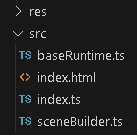

# Create Basic Scene

We're going to configure the optimized scene first.

In this tutorial, we write code that is cumbersome but user-friendly and gives us a great user experience.

:::info
In this example, you can learn how to deal with multiple problem situations using an asset that requires a lot of modification, which can be very cumbersome.
:::

## Clone the `babylon-mmd-template` repository

Project setups can vary widely depending on personal preferences. However, for starters, I recommend the **[babylon-mmd-template](https://github.com/noname0310/babylon-mmd-template.git)** repository as a template for using babylon-mmd

Clone the repository using git:

```bash
git clone https://github.com/noname0310/babylon-mmd-template.git
```

When you open a cloned repository in vscode, src requires these four sources(other files can be deleted):



Let's first run the project in watch mode.

```bash
npm i
npm start
```

It's okay if there's still an error Let's open [https://localhost:20310](https://localhost:20310) in the browser and write the code.

Start with the blank template.

```typescript title="src/sceneBuilder.ts"
import { MmdCamera } from "babylon-mmd/esm/Runtime/mmdCamera";
import type { ISceneBuilder } from "./baseRuntime";
import { Engine } from "@babylonjs/core/Engines/engine";
import { Scene } from "@babylonjs/core/scene";
import { Color4 } from "@babylonjs/core/Maths/math.color";
import { Vector3 } from "@babylonjs/core/Maths/math.vector";

export class SceneBuilder implements ISceneBuilder {
    public async build(_canvas: HTMLCanvasElement, engine: Engine): Promise<Scene> {
        const scene = new Scene(engine);
        scene.clearColor = new Color4(0.95, 0.95, 0.95, 1.0);

        const mmdCamera = new MmdCamera("mmdCamera", new Vector3(0, 10, 0), scene);
        mmdCamera.maxZ = 5000;
        
        return scene;
    }
}
```

:::danger
you must not use `import { MmdCamera } from "babylon-mmd";` or `import { Engine } from "@babylonjs/core";` for treeshaking.
:::

add light, shadow, and ground.

```typescript title="src/sceneBuilder.ts"
const hemisphericLight = new HemisphericLight("hemisphericLight", new Vector3(0, 1, 0), scene);
hemisphericLight.intensity = 0.3;
hemisphericLight.specular.set(0, 0, 0);
hemisphericLight.groundColor.set(1, 1, 1);

const directionalLight = new DirectionalLight("directionalLight", new Vector3(0.5, -1, 1), scene);
directionalLight.intensity = 0.7;
directionalLight.autoCalcShadowZBounds = false;
directionalLight.autoUpdateExtends = false;
directionalLight.shadowMaxZ = 20;
directionalLight.shadowMinZ = -20;
directionalLight.orthoTop = 18;
directionalLight.orthoBottom = -3;
directionalLight.orthoLeft = -10;
directionalLight.orthoRight = 10;
directionalLight.shadowOrthoScale = 0;

const shadowGenerator = new ShadowGenerator(1024, directionalLight, true);
shadowGenerator.usePercentageCloserFiltering = true;
shadowGenerator.forceBackFacesOnly = false;
shadowGenerator.bias = 0.01;
shadowGenerator.filteringQuality = ShadowGenerator.QUALITY_MEDIUM;
shadowGenerator.frustumEdgeFalloff = 0.1;

const ground = CreateGround("ground1", { width: 120, height: 120, subdivisions: 2, updatable: false }, scene);
const groundMaterial = ground.material = new StandardMaterial("groundMaterial", scene);
groundMaterial.diffuseColor = new Color3(1.02, 1.02, 1.02);
ground.receiveShadows = true;
```

- The parameters are the values I set. It can be changed as much as possible.
- DirectionalLight's shadow frustum has been minimized to fit a single mmd model.


Both the floor and the background are white, so you can't see anything.
