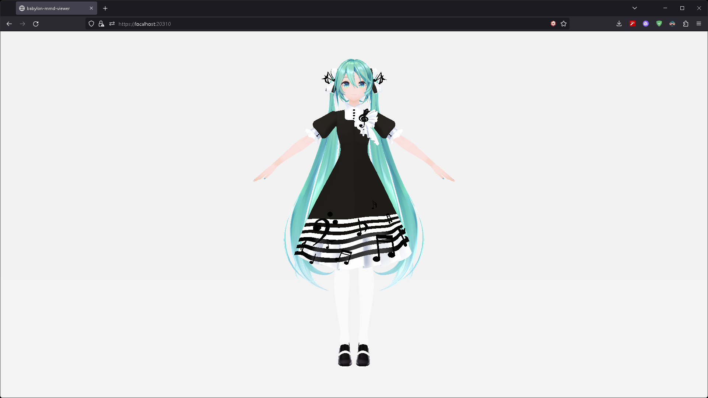
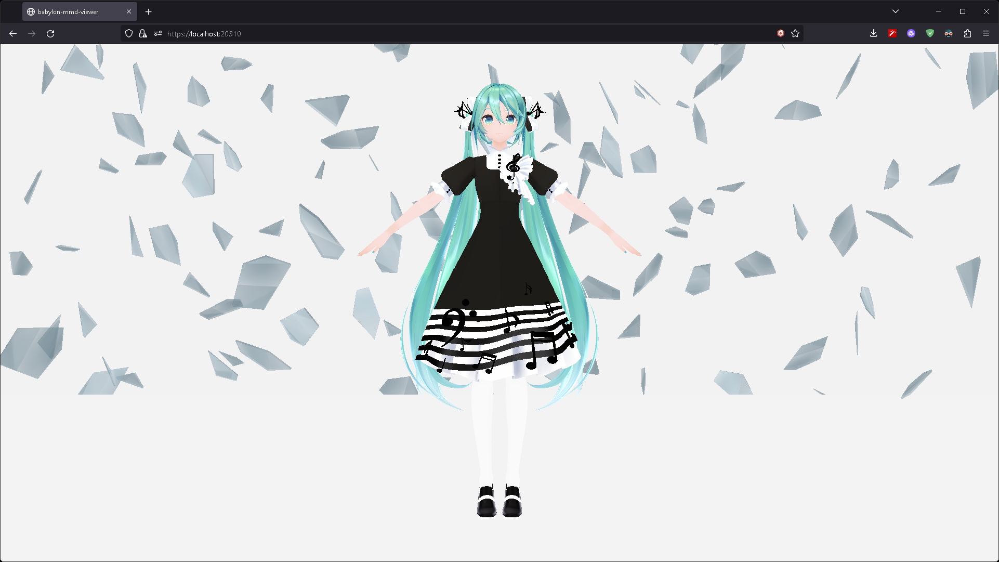
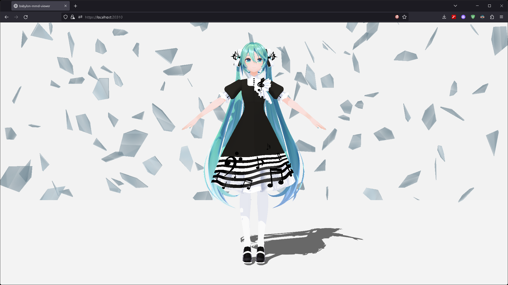

# Load BPMX Model

Learn how to load models in BPMX format.

## Load BPMX Model as Skinned Mesh

BPMX specs may have more than 0 Bone or MorphTarget, so basically everything loaded by `BpmxLoader` is Skinned Mesh even if it has no Bone or MorphTarget. (The same applies to the `PmxLoader`.)

For load bpmx model, we need to import side effects.

```typescript title="src/sceneBuilder.ts"
import "babylon-mmd/esm/Loader/Optimized/bpmxLoader";
```

:::info
If your model uses textures such as TGA, don't forget to also import the side effects for TGA textures.

```typescript
// side effects for TGA textures
import "@babylonjs/core/Materials/Textures/Loaders/tgaTextureLoader";
```
:::

Then, load the model using the `SceneLoader`.

```typescript title="src/sceneBuilder.ts"
const bpmxLoader = SceneLoader.GetPluginForExtension(".bpmx") as BpmxLoader;
bpmxLoader.loggingEnabled = true;
const materialBuilder = bpmxLoader.materialBuilder as MmdStandardMaterialBuilder;
materialBuilder.loadOutlineRenderingProperties = (): void => { /* do nothing */ };

engine.displayLoadingUI();

bpmxLoader.boundingBoxMargin = 60;
const modelMesh = await SceneLoader.ImportMeshAsync(
    undefined,
    "res/",
    "YYB Piano dress Miku.bpmx",
    scene,
    (event) => engine.loadingUIText = `Loading model... ${event.loaded}/${event.total} (${Math.floor(event.loaded * 100 / event.total)}%)`
).then((result) => result.meshes[0] as MmdMesh);

modelMesh;

scene.onAfterRenderObservable.addOnce(() => engine.hideLoadingUI());
```

- `SceneLoader.GetPluginForExtension(".bpmx")` - Get the `BpmxLoader` from the `SceneLoader`.

- `bpmxLoader.loggingEnabled = true;` - Enable logging for better debugging.

- `bpmxLoader.materialBuilder` - In this case we get the `MmdStandardMaterialBuilder` from the `BpmxLoader`. If you implement your own material builder, you can pass it to the loader.

- `materialBuilder.loadOutlineRenderingProperties = (): void => { /* do nothing */ };` - Override the method to disable outline rendering. (This is just a setting for the goal in this example.)

- `bpmxLoader.boundingBoxMargin = 60;` - Set the bounding box margin. (The default value is 10.)

:::info
Basically, dance motion can cause curring problem because it moves mesh a lot from rest pose.

And the motion that we're going to use in this next example is especially problematic, so we need to make the bounding box bigger.
:::

:::tip
If you change the settings of the `BpmxLoader` before calling `ImportMeshAsync`, the settings will be applied to the loaded model.

The reason for using this method is that `ImportMeshAsync` does not have a parameter to pass the load options to the loader.
:::



:::info
`BJS - [19:42:52]: Failed to load sphere texture: file:res/YYB Piano dress Miku.bpmx_`

You'll see this error message. These errors are often displayed when the 3D model data itself is incorrect, and to resolve this, the asset must be modified by using a editor such as [Pmx Editor](https://www.deviantart.com/johnwithlenon/art/PmxEditor-v0273-English-Version-unofficial-trans-925125044).
:::

## Load BPMX Model as Static Mesh

For models such as Stage, it is usually static. Importing these models into a static mesh can save performance.

```typescript title="src/sceneBuilder.ts"
bpmxLoader.boundingBoxMargin = 0;
bpmxLoader.buildSkeleton = false;
bpmxLoader.buildMorph = false;
// promises.push(
await SceneLoader.ImportMeshAsync(
    undefined,
    "res/",
    "ガラス片ドームB.bpmx",
    scene,
    (event) => engine.loadingUIText = `Loading stage... ${event.loaded}/${event.total} (${Math.floor(event.loaded * 100 / event.total)}%)`
);
```

- `bpmxLoader.boundingBoxMargin = 0;` - Set the bounding box margin to 0. (because static mesh doesn't move)
- `bpmxLoader.buildSkeleton = false;` - Disable building skeleton.
- `bpmxLoader.buildMorph = false;` - Disable building morph.

:::info
Naturally, mmd models loaded with static mesh cannot be controlled by MMD Runtime.
:::



## Load multiple assets simultaneously

Now, we are awaiting the model and stage to load one by one, but we can load them simultaneously by using `Promise.all`.

```typescript title="src/sceneBuilder.ts"
const bpmxLoader = SceneLoader.GetPluginForExtension(".bpmx") as BpmxLoader;
bpmxLoader.loggingEnabled = true;

engine.displayLoadingUI();

let loadingTexts: string[] = [];
const updateLoadingText = (updateIndex: number, text: string): void => {
    loadingTexts[updateIndex] = text;
    engine.loadingUIText = "<br/><br/><br/><br/>" + loadingTexts.join("<br/><br/>");
};

const promises: Promise<any>[] = [];

bpmxLoader.boundingBoxMargin = 60;
promises.push(SceneLoader.ImportMeshAsync(
    undefined,
    "res/",
    "YYB Piano dress Miku.bpmx",
    scene,
    (event) => updateLoadingText(0, `Loading model... ${event.loaded}/${event.total} (${Math.floor(event.loaded * 100 / event.total)}%)`)
).then((result) => result.meshes[0]));

bpmxLoader.boundingBoxMargin = 0;
bpmxLoader.buildSkeleton = false;
bpmxLoader.buildMorph = false;
promises.push(SceneLoader.ImportMeshAsync(
    undefined,
    "res/",
    "ガラス片ドームB.bpmx",
    scene,
    (event) => updateLoadingText(1, `Loading stage... ${event.loaded}/${event.total} (${Math.floor(event.loaded * 100 / event.total)}%)`)
));

loadingTexts = new Array(promises.length).fill("");

const loadResults = await Promise.all(promises);
scene.onAfterRenderObservable.addOnce(() => engine.hideLoadingUI());

loadResults;
```

- Simply added `Promise.all` and the loading screen.

## Add Shadow to Model

```typescript title="src/sceneBuilder.ts"
const modelMesh = loadResults[0] as MmdMesh;
for (const mesh of modelMesh.metadata.meshes) mesh.receiveShadows = true;
shadowGenerator.addShadowCaster(modelMesh);
```

Pretty easy, right?


